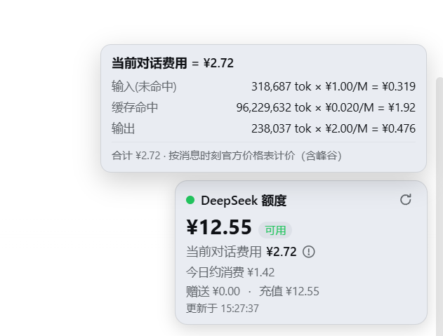

# dsh-deepseek-quota

A plugin for the [DeepSeek Harness](https://github.com/deepseek-ai/deepseek-harness) (DSH) **web GUI** that shows your remaining **DeepSeek API quota (balance)** in a floating card pinned to the **bottom-right corner** of the page.



`中文说明见下文。`

## Fork notes

Community fork of the original `dsh-deepseek-quota` (MIT, © yingjunnan) with the
following additions on top of upstream `0.4.0` (v0.5.0):

- **Draggable card**: press anywhere on the card (except buttons / the ⓘ icon)
  to move it freely; the position persists in `localStorage`; **double-click**
  resets it to the bottom-right corner.
- **dsh-better-sidebar awareness**: the card never hides under the sidebar's
  expanded right/bottom panels (their `position: fixed; z-index: 50` would
  cover the `shell.overlay` layer at z-index 20). It watches the
  `--dsh-sidebar-width` / `--dsh-sidebar-height` CSS variables and shifts out
  of the panel area with a transition matched to the panel animation
  (`--ds-transition-duration-slow`), then returns to the saved position when
  the panels collapse. Works without better-sidebar installed (no-ops).
- **Fixed "today's consumption ≈ ¥0" after a mid-day top-up**: the meter now
  accumulates balance *decreases* instead of `max(0, opening − current)`, so
  recharging no longer masks spending. State upgraded to
  `{ date, opening, last, consumed }` (legacy state migrates automatically).
- **Compact layout**: "today's consumption" and "current conversation cost"
  share a two-column grid, and the update time moved into the header row
  (3 rows total in the common case). The granted/top-up breakdown row only
  appears when a granted balance actually exists, avoiding a redundant
  duplicate of the total (total = granted + topped-up, all "remaining").

## Features

- Bottom-right overlay card (registered into the frame-wide `shell.overlay` slot — additive, never blocks the app).
- Shows **total balance**, availability, **current conversation cost**, **today's consumption**, and the **granted** / **topped-up** balance.
- **Current conversation cost** (`当前对话费用`): the host prices every `assistant/message` with the official DeepSeek price table (incl. peak/off-peak since 2026-08-17; pricing engine ported from [dsh-web-billing](https://github.com/bpc-oss/dsh-web-billing), MIT) and reports the current session's accumulated cost via `GET /api/deepseek-session-cost?sessionId=<id>` — the whole conversation is replayed from its persisted log, so the figure includes history from before the plugin was installed. Hover the circled **ⓘ** next to the value to see the live formula with real numbers (`输入/缓存命中/输出 tokens × 单价 = 小计`, with the effective blended ¥/M rate).
- Auto-refreshes every 60 s (balance) / 5 s (conversation cost), plus a manual refresh button.
- Follows the app's light/dark theme (`--dsw-*` tokens).
- Explicit error states: missing API key, network failure, provider errors.
- The API key never leaves your machine — the browser only talks to local routes that the host half registers.

## Install

Requires the DSH CLI and [pnpm](https://pnpm.io/installation).

```sh
dsh plugin --profile web add github:wanglaixiang-cyber/dsh-deepseek-quota
```

The package declares `dsh.bundle`, so `dsh plugin` automatically adds it to the profile's bundle layers (no manual patch editing). Then:

1. Restart the web app: `dsh web` (bundle layers are read at boot).
2. Open http://127.0.0.1:3080 and refresh the page.
3. The balance card appears at the bottom-right.

> Manual alternative: install the package into the profile's `node_modules` and add a loader entry to `~/.dsh/profiles/web/cordis.patch.yml`:
>
> ```yaml
> - insert:
>     - id: deepseek-quota
>       name: dsh-deepseek-quota
> ```

## Configuration

The plugin reads the **same API key the harness already uses**: `DEEPSEEK_API_KEY`, resolved through the credentials service (set it on the **Settings → Models** page; it is stored in `~/.dsh/.credentials.yaml`, or export it in the launching environment).

### Today's consumption (`今日已消费`)

The official DeepSeek API exposes no usage query endpoint, so the widget uses two sources, in order:

1. **Official (preferred)** — the same date-filterable data the platform console shows. Configure the optional platform session token:

   ```sh
   # get the token: log in to https://platform.deepseek.com, open DevTools → Console, run:
   #   JSON.parse(localStorage.getItem('userToken')).value
   # then store it as a credential (e.g. add to ~/.dsh/.credentials.yaml):
   #   DEEPSEEK_PLATFORM_TOKEN: <token>
   ```

   With the token set, the host queries `platform.deepseek.com/api/v0/usage/cost?month=&year=` and picks today's row. The card shows `今日已消费 ¥X.XX`.

2. **Estimate (fallback)** — without the token, the host meters the balance (`max(0, day-opening balance − current)`), persisted under `~/.dsh/storages/deepseek-quota-day.json`. The card shows `今日约消费 ≈¥X.XX` so it is never mistaken for an official figure. Note the official usage page can also be filtered to "today" — the platform token unlocks that same data.

No other configuration needed.

## How it works

| Part | File | What it does |
|---|---|---|
| Host half | `lib/index.js` | Cordis plugin (`inject: credentials, webServer`) registering `GET /api/deepseek-balance` (balance + today's consumption) and `GET /api/deepseek-session-cost?sessionId=<id>` (current conversation cost); subscribes `session/event` to price every `assistant/message`. |
| Pricing | `lib/pricing.js` | Official DeepSeek price-table engine (policy timeline + peak/off-peak), ported from [dsh-web-billing](https://github.com/bpc-oss/dsh-web-billing) (MIT). |
| Browser half | `lib/client.js` | `dsh.client` web bundle registering the widget into `shell.overlay`; polls balance every 60 s and the current session's cost every 5 s. |
| Composition | `cordis.patch.yml` | The `dsh.bundle` patch layer that inserts the loader entry. |

## Development

```sh
git clone <your-fork>
cd dsh-deepseek-quota
# edit lib/index.js (host) / lib/client.js (browser half)
# install locally and test:
dsh plugin --profile web add .
```

After changing `lib/client.js`, restart `dsh web` so the boot-graph hash (`rev`) regenerates, then hard-refresh the page.

## License

MIT

---

# 中文说明

一个给 DeepSeek Harness（DSH）**网页界面**用的插件：在页面**右下角**悬浮显示你的 **DeepSeek API 额度（余额）** 与 **今日消费**。

## Fork 说明（v0.5.0）

社区 fork（上游为 MIT 协议的 `dsh-deepseek-quota` 0.4.0，© yingjunnan），在原有功能基础上新增：

- **卡片可拖动**：按住卡片任意位置（按钮/ⓘ 除外）自由移动，位置持久化到 `localStorage`；**双击**复位到右下角。
- **适配 dsh-better-sidebar**：侧边栏/底部面板展开时（`position: fixed; z-index: 50`，会盖住 z-index 20 的 overlay 层）卡片自动让位，跟随 `--dsh-sidebar-width` / `--dsh-sidebar-height` 变量移动，动画时长与面板一致（`--ds-transition-duration-slow`）；面板收起后自动回到原位置。未安装 better-sidebar 时无任何影响。
- **修复"今日约消费 ¥0"**：原差值法（`期初 − 当前`）在**当天充值**后会把消费掩盖成 0；改为**累计模式**——只累加余额减少量，充值不再清零累计。状态升级为 `{ date, opening, last, consumed }`（旧格式自动迁移）。
- **紧凑布局**："今日消费"与"当前对话费用"双列并排，更新时间并入标题行（常规情况下整卡 3 行）。赠送/充值明细仅在存在赠送余额时显示，避免与总额重复（总额 = 赠送 + 充值，均为"当前剩余"）。

## 功能

- 右下角悬浮卡片（注册在框架级 `shell.overlay` 槽位，纯叠加、不遮挡应用）。
- 显示**总余额**、可用状态、**当前对话费用**、**今日已消费**、**赠送余额**与**充值余额**。
- **当前对话费用**：宿主侧对每条 `assistant/message` 按官方价格表计价（含 2026-08-17 起峰谷定价；定价引擎移植自 [dsh-web-billing](https://github.com/bpc-oss/dsh-web-billing)，MIT），通过 `GET /api/deepseek-session-cost?sessionId=<id>` 返回当前会话累计费用——按持久化日志全量回放，包含安装前（重启前）的历史。把鼠标放到费用后面的**圆圈叹号 ⓘ** 上，会显示代入真实数值的计算公式（输入/缓存命中/输出 tokens × 单价 = 小计，单价为加权有效价 ¥/M）。
- 余额每 60 秒自动刷新、对话费用每 5 秒刷新，也可手动刷新。
- 自动跟随应用浅色/深色主题（使用 `--dsw-*` 设计变量）。
- 明确的错误状态：未配置 Key、网络失败、接口报错等。
- API Key 不出本机：浏览器只访问本地路由（由宿主侧注册）。

## 安装

需要 DSH CLI 与 [pnpm](https://pnpm.io/installation)。

```sh
dsh plugin --profile web add github:wanglaixiang-cyber/dsh-deepseek-quota
```

该包声明了 `dsh.bundle`，`dsh plugin` 会自动把它加进 profile 的 bundle 层（无需手动改配置）。之后：

1. 重启网页应用：`dsh web`（bundle 层在启动时读取）。
2. 打开 http://127.0.0.1:3080 并刷新页面。
3. 右下角即出现额度卡片。

> 手动方式：把包放进 profile 的 `node_modules`，并在 `~/.dsh/profiles/web/cordis.patch.yml` 中加一条：
>
> ```yaml
> - insert:
>     - id: deepseek-quota
>       name: dsh-deepseek-quota
> ```

## 配置

插件读取的正是 harness 自己在用的那个 Key：`DEEPSEEK_API_KEY`（通过凭证服务解析；在 **设置 → 模型** 页面填写，存于 `~/.dsh/.credentials.yaml`，或在启动环境中导出）。

### 今日消费（`今日已消费`）

DeepSeek 官方 API 没有开放用量查询接口，所以插件按优先级使用两种来源：

1. **官方数据（优先）**——与平台控制台相同的可按日期筛选的数据。需要配置可选的平台会话令牌：

   ```sh
   # 获取令牌：登录 https://platform.deepseek.com，打开 DevTools → Console，执行：
   #   JSON.parse(localStorage.getItem('userToken')).value
   # 然后把值写入凭证（例如追加到 ~/.dsh/.credentials.yaml）：
   #   DEEPSEEK_PLATFORM_TOKEN: <令牌>
   ```

   配置后，宿主侧调用 `platform.deepseek.com/api/v0/usage/cost?month=&year=` 并取"今天"那一行。卡片显示 `今日已消费 ¥X.XX`。

2. **估算（兜底）**——未配置令牌时，宿主侧按余额差值估算（`max(0, 当天期初余额 − 当前余额)`，状态存于 `~/.dsh/storages/deepseek-quota-day.json`）。卡片显示 `今日约消费 ≈¥X.XX`，避免被误认为官方数字。

无需其它配置。

## 工作原理

| 部分 | 文件 | 作用 |
|---|---|---|
| 宿主侧 | `lib/index.js` | Cordis 插件（`inject: credentials, webServer`），注册 `GET /api/deepseek-balance`（余额+今日消费）与 `GET /api/deepseek-session-cost?sessionId=<id>`（当前对话费用）；订阅 `session/event` 对每条 `assistant/message` 计价。 |
| 定价 | `lib/pricing.js` | DeepSeek 官方价格引擎（政策时间表 + 峰谷定价），移植自 [dsh-web-billing](https://github.com/bpc-oss/dsh-web-billing)（MIT）。 |
| 浏览器侧 | `lib/client.js` | `dsh.client` 网页包，把组件注册进 `shell.overlay`；余额每 60 秒轮询、当前会话费用每 5 秒轮询。 |
| 组合层 | `cordis.patch.yml` | `dsh.bundle` 补丁层，插入加载项。 |

## 开发

```sh
git clone <你的仓库>
cd dsh-deepseek-quota
# 修改 lib/index.js（宿主）/ lib/client.js（浏览器侧）
# 本地安装测试：
dsh plugin --profile web add .
```

修改 `lib/client.js` 后需重启 `dsh web` 以重新生成引导哈希（`rev`），再强制刷新页面。

## 协议

MIT
